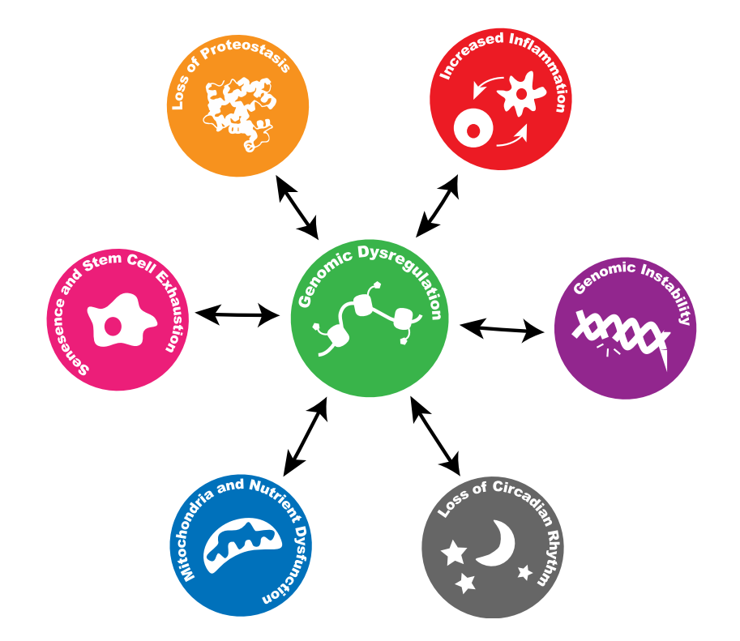
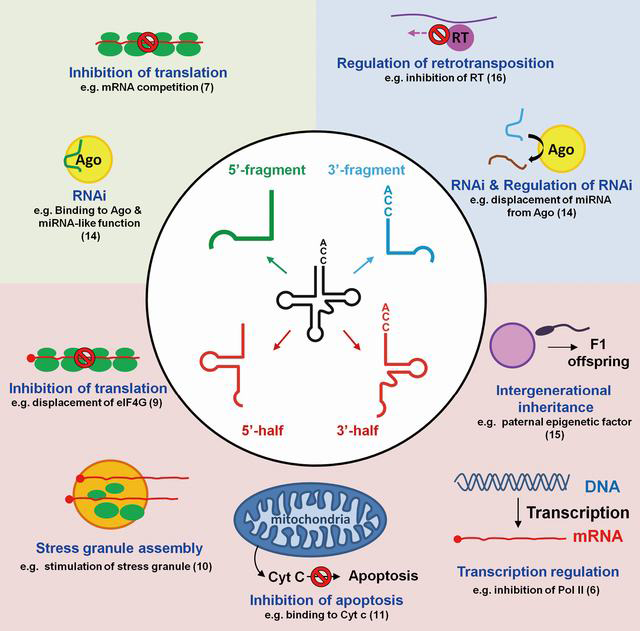
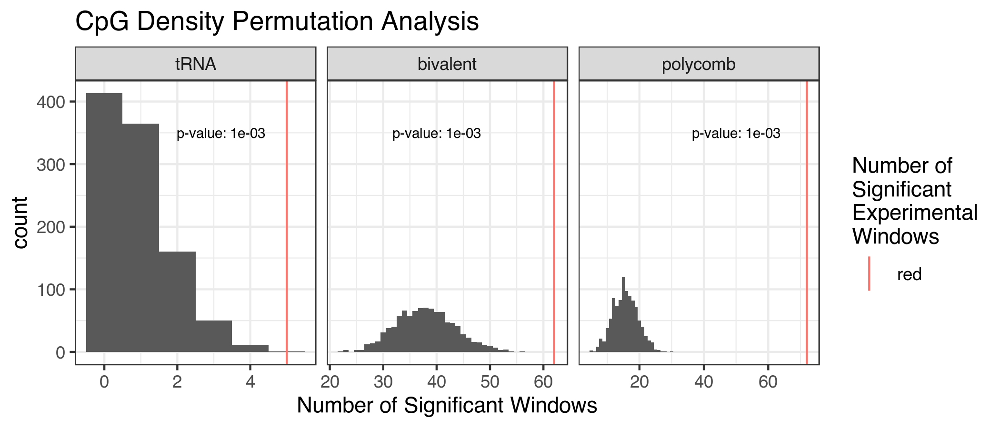

```{r, echo=FALSE,include=FALSE}
suppressPackageStartupMessages({
	library(dplyr)
	library(ggplot2)
	library(readr)
	library(plotly)
	library(kableExtra)
})
```


structure notes

- Why?
	- Ageing
	- epigenetics ~ ageing
	- prior tRNA result ~ artifact?
	- tRNA biology ~ ageing
		- tsRNAs
		- tRNA modifications
- What - Results
	- meDip
		- immunoprecipitation / regional
	- age related DNA hypermethylation
	- enrichment, CpG density permutation
	- array
		- bisulfite conversion based, highly quantitative
		- within the tRNA
	- Targeted
		- pooling
		- compare duplicates / isodecoders

# Ageing

## Burden of disease

Ageing is the major risk factor for

- Cancer
- Heart Disease
- Dementia
- Type 2 Diabetes
- Other Chronic Diseases

$\therefore$ 

Understanding Ageing

- $\uparrow$ Healthspan / $\downarrow$ Morbidity
- $\downarrow$ Age-related Diseases

<section data-notes="
	- Eliminating any one of these minimal impact on average lifespan
	- Frailty ~
"></section>

## Multisystem Nature of Ageing

Epigentics - Hub of the Hallmarks of Ageing

```{r, out.width='50%', fig.show='hold', fig.align = 'center', echo=FALSE}

```

<small>Booth & Brunet 2016 *MolCell* [@Booth2016]</small>

Loss of epigenetic information $\rightarrow$ Dysregulation

<section data-notes="
	- loss of epigenetic information -> Dysregulation
"></section>

## Epigenetic Clocks

Epigenetic Changes Capture Biological Ageing

```{r, out.width='40%', fig.show='hold', fig.align = 'center', echo=FALSE}
knitr::include_graphics("./graphics/LBC1921_Horvath1_survival.png")
```

<small>Horvath 2013 *GenBio* [@Horvath2013], Marioni et al. 2015 *GenBio* [@Marioni2015]</small>

# Transfer RNAs (tRNAs)

- Bell et al. 2016 *GenBio* [@Bell2016], supplementary result
- tRNA-iMet-CAT-1-4 DNAm $\uparrow$ with Age

```{r, out.width='50%', fig.show='hold', fig.align = 'center', echo=FALSE}
knitr::include_graphics("./graphics/translation5.gif")
```

Fundamental to the information flow from DNA to Protein

## tRNA derived small RNAs

```{r, out.width='55%', fig.show='hold', fig.align = 'center', echo=FALSE}

```

$+$ internal tRNA fragments & piRNAs

## tRNA modifications

- Most heavily modified RNA species
	- $>$ 100 different modifications
- 11-13 per tRNA molecule [@Schimmel2017]

```{r, out.width='55%', fig.show='hold', fig.align = 'center', echo=FALSE}
#@Hopper2013
knitr::include_graphics("./graphics/tRNA_modifications_yeast.jpeg")
```

## Human tRNAome

- Up to 610 tRNA genes
- median length 73bp
- <46kb, 0.002% of the Genome
- 2nd most abundant RNA species, ~60 million/cell

```{r, echo=FALSE, warning=FALSE, message=FALSE, out.width='85%', fig.show='hold', fig.align = 'center'}
tRNAs <- read_tsv(
	"~/Documents/PhD_Stuff/phd/Projects/tRNA_Stuff/tRNA-GtRNAdb/hg19-tRNAs.bed",
	col_types = cols(.default = col_character()),
	col_names = colnames(read_tsv(
		"~/Documents/PhD_Stuff/phd/Projects/tRNA_Stuff/tRNA-GtRNAdb/std_tRNA_header.txt",
		col_names = TRUE,
		col_types = cols(.default = col_character())
	))
)

tRNAs %>%
	group_by(tChr) %>%
	summarize(count = n()) %>%
	plot_ly(
		labels = ~tChr, values = ~count,
		width = 800, height = 400
	) %>%
	add_pie(hole = 0.6) %>%
	layout(
		margin = list(t = 50),
		title = "Proportion of tRNAs By Chromosome",  showlegend = TRUE,
		xaxis = list(
			showgrid = FALSE, zeroline = FALSE, showticklabels = FALSE
		),
		yaxis = list(
			showgrid = FALSE, zeroline = FALSE, showticklabels = FALSE
		)
	)
```

## tRNA expression

- RNA polymerase III [@Schramm2002]
- Internal Promoter Structure
- Clustered with other tRNA genes in 3D
- tRNA genes act as insulators

```{r out.width='50%', fig.show='hold', fig.align = 'center', echo=FALSE}
knitr::include_graphics("./graphics/tRNA-PollIII.png")
```

## tRNAs & Ageing

- $\downarrow$ Translation, $\uparrow$ Longevity [@Hansen2007]
- Ageing ~ TORC1 $\dashv$ Maf1 $\dashv$ polIII $\dashv$ tRNA expression
- $\downarrow$ polIII, $\uparrow$ Longevity [@Filer2017]
- Circulating tRNA halves modulated by ageing and calorie restriction [@Dhahbi2013]
- tsRNAs in stress response

~ 


# Results

## Age-related DNA hypermethyation

- tRNAome-wide significant $8.36\times10^{-5}$
	- Batch corrected __44__ $\uparrow$, $\downarrow$ 0
	- Batch and Blood Cell-type corrected __16__ $\uparrow$, $\downarrow$ 0
		
- 21 genome-wide significant and 44 study-wide significant 

```{r, out.width='60%', echo=FALSE,}
bb6tRNASummaryTab <- read_tsv(
	"./data/bb3tRNASummaryTab.tsv",
	progress = FALSE,
	col_types = cols(
		.default = col_character()
	)
)

bb6tRNASummaryTabKable <- 
bb6tRNASummaryTab %>% 
	kable(
		#digits = 2,
		format = "html",#"latex",
		escape = FALSE,
		booktabs = TRUE,
		#caption = "(ref:GWSBBtRNAsTabCap)",
		linesep = ""
	) %>%
	kable_styling(
		bootstrap_options = "striped", full_width = FALSE,
		latex_options = c("striped", "scale_down")
	) %>%#, fixed_thead = TRUE
	#row_spec(0, background = "#b8b8b8") %>%
	column_spec(1, bold = TRUE, border_right = TRUE)

bb6tRNASummaryTabKable
```

## Enrichment for DNA hypermethylation

```{r out.width='50%', fig.show='hold', fig.align = 'center', echo=FALSE}
knitr::include_graphics("./graphics/nSigWinProps_WGfishers_BB_sws_hyper_2_BL_noPolyBivExcl_BarTxtast_sr.png")
```

## ... Comparable CpG Density

```{r out.width='75%', fig.show='hold', fig.align = 'center', echo=FALSE}

```

# References

---
<small>
<div id="refs"></div>
</small>

---

## Human tRNAome

```{r, out.width='85%', fig.show='hold', fig.align = 'center', echo=FALSE}
knitr::include_graphics("./graphics/kutteresq_BLcount.png")
```

() = pseudo genes, [] = in blacklisted regions
