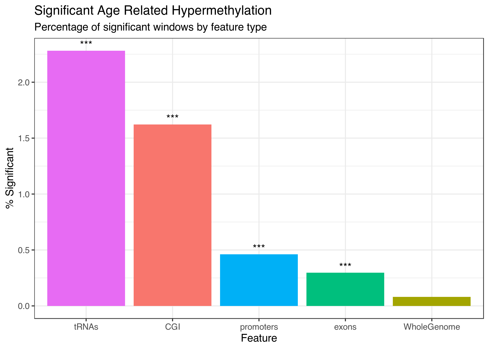
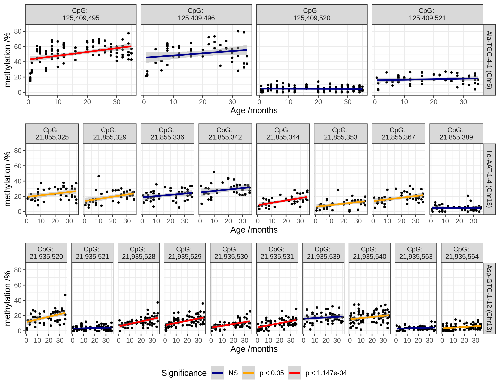
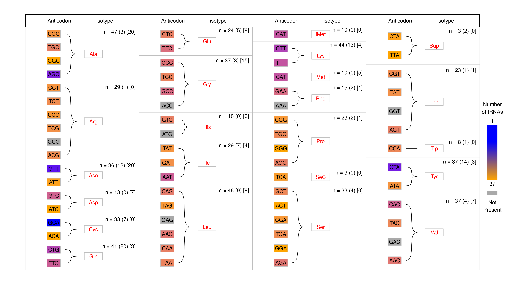

```{r, echo=FALSE,include=FALSE}
suppressPackageStartupMessages({
	library(dplyr)
	library(ggplot2)
	library(readr)
	library(plotly)
	library(kableExtra)
	library(emo)
})
```


structure notes

- Why?
	- Ageing
	- epigenetics ~ ageing
	- prior tRNA result ~ artifact?
	- tRNA biology ~ ageing
		- tsRNAs
		- tRNA modifications
- What - Results
	- meDip
		- immunoprecipitation / regional
	- age related DNA hypermethylation
	- enrichment, CpG density permutation
	- array
		- bisulfite conversion based, highly quantitative
		- within the tRNA
	- Targeted
		- pooling
		- compare duplicates / isodecoders

# Ageing

## Burden of disease

Ageing is the major risk factor for

- Cancer
- Heart Disease
- Dementia
- Type 2 Diabetes
- Other Chronic Diseases

$\therefore$ 

Understanding Ageing

- $\uparrow$ Healthspan / $\downarrow$ Morbidity
- $\downarrow$ Age-related Diseases

<section data-notes="
	- Eliminating any one of these minimal impact on average lifespan
	- Frailty ~
"></section>

## Multisystem Nature of Ageing

Epigentics - Hub of the Hallmarks of Ageing

```{r, out.width='50%', fig.show='hold', fig.align = 'center', echo=FALSE}
knitr::include_graphics("./graphics/Booth2016_F3_epigenomeHubAgingHallmarks.png")
```

<small>Booth & Brunet 2016 *MolCell* [@Booth2016]</small>

Loss of epigenetic information $\rightarrow$ Dysregulation

<section data-notes="
	- loss of epigenetic information -> Dysregulation
"></section>

## Epigenetic Clocks

Epigenetic Changes Capture Biological Ageing

```{r, out.width='40%', fig.show='hold', fig.align = 'center', echo=FALSE}
knitr::include_graphics("./graphics/LBC1921_Horvath1_survival.png")
```

<small>Horvath 2013 *GenBio* [@Horvath2013], Marioni et al. 2015 *GenBio* [@Marioni2015]</small>

# Transfer RNAs (tRNAs)

- Bell et al. 2016 *GenBio* [@Bell2016], supplementary result
- tRNA-iMet-CAT-1-4 DNAm $\uparrow$ with Age

```{r, out.width='50%', fig.show='hold', fig.align = 'center', echo=FALSE}
knitr::include_graphics("./graphics/translation5.gif")
```

Fundamental to the information flow from DNA to Protein

## tRNA derived small RNAs

```{r, out.width='55%', fig.show='hold', fig.align = 'center', echo=FALSE}
knitr::include_graphics("./graphics/tRNAderivedSmallRNARoles.png")
```

$+$ internal tRNA fragments & piRNAs

## tRNA modifications

- Most heavily modified RNA species
	- $>$ 100 different modifications
- 11-13 per tRNA molecule [@Schimmel2017]

```{r, out.width='55%', fig.show='hold', fig.align = 'center', echo=FALSE}
#@Hopper2013
knitr::include_graphics("./graphics/tRNA_modifications_yeast.jpeg")
```

## Human tRNAome

- Up to 610 tRNA genes
- median length 73bp
- <46kb, 0.002% of the Genome
- 2nd most abundant RNA species, ~60 million/cell

```{r, echo=FALSE, warning=FALSE, message=FALSE, out.width='85%', fig.show='hold', fig.align = 'center'}
tRNAs <- read_tsv(
	"~/Documents/PhD_Stuff/phd/Projects/tRNA_Stuff/tRNA-GtRNAdb/hg19-tRNAs.bed",
	col_types = cols(.default = col_character()),
	col_names = colnames(read_tsv(
		"~/Documents/PhD_Stuff/phd/Projects/tRNA_Stuff/tRNA-GtRNAdb/std_tRNA_header.txt",
		col_names = TRUE,
		col_types = cols(.default = col_character())
	))
)

tRNAs %>%
	group_by(tChr) %>%
	summarize(count = n()) %>%
	plot_ly(
		labels = ~tChr, values = ~count,
		width = 800, height = 400
	) %>%
	add_pie(hole = 0.6) %>%
	layout(
		margin = list(t = 50),
		title = "Proportion of tRNAs By Chromosome",  showlegend = TRUE,
		xaxis = list(
			showgrid = FALSE, zeroline = FALSE, showticklabels = FALSE
		),
		yaxis = list(
			showgrid = FALSE, zeroline = FALSE, showticklabels = FALSE
		)
	)
```

<section data-notes="
	- 23 nuclear encoded mitochondrial tRNAs
	- 116 potential pseudogenes
	- 107 are in blacklisted regions
	- 7 of the 61 non-STOP codons are missing - wobble pairing
		- (*e.g.* GCG Arg, ACC Gly)
"></section>

## tRNA expression

- RNA polymerase III [@Schramm2002]
- Internal Promoter Structure
- Clustered with other tRNA genes in 3D
- tRNA genes act as insulators

```{r out.width='50%', fig.show='hold', fig.align = 'center', echo=FALSE}
knitr::include_graphics("./graphics/tRNA-PollIII.png")
```

## tRNAs & Ageing

- $\downarrow$ Translation, $\uparrow$ Longevity [@Hansen2007]
- Ageing ~ TORC1 $\dashv$ Maf1 $\dashv$ polIII $\dashv$ tRNA expression
- $\downarrow$ polIII, $\uparrow$ Longevity [@Filer2017]
- Circulating tRNA halves modulated by ageing and calorie restriction [@Dhahbi2013]
- tsRNAs in stress response

~ 


# Results

## Age-related DNA hypermethyation

- tRNAome-wide significant (p < $8.36\times10^{-5}$)
	- Batch corrected __44__ $\uparrow$, $\downarrow$ 0
	- Batch and Blood Cell-type corrected __16__ $\uparrow$, $\downarrow$ 0
- Genome-wide significant (p < $4.34\times10^{-9}$)
	- 3 Batch and Blood Cell-type corrected

```{r, out.width='60%', echo=FALSE,}
bb6tRNASummaryTab <- read_tsv(
	"./data/bb3tRNASummaryTab.tsv",
	progress = FALSE,
	col_types = cols(
		.default = col_character()
	)
)

bb6tRNASummaryTabKable <- 
bb6tRNASummaryTab %>% 
	kable(
		#digits = 2,
		format = "html",#"latex",
		escape = FALSE,
		booktabs = TRUE,
		#caption = "(ref:GWSBBtRNAsTabCap)",
		linesep = ""
	) %>%
	kable_styling(
		bootstrap_options = "striped", full_width = FALSE,
		latex_options = c("striped", "scale_down")
	) %>%#, fixed_thead = TRUE
	#row_spec(0, background = "#b8b8b8") %>%
	column_spec(1, bold = TRUE, border_right = TRUE)

bb6tRNASummaryTabKable
```

## Enrichment for DNA hypermethylation

```{r out.width='50%', fig.show='hold', fig.align = 'center', echo=FALSE}

```

## CpG Density Permutation

```{r out.width='75%', fig.show='hold', fig.align = 'center', echo=FALSE}
knitr::include_graphics("./graphics/tRNA-poly-bivP_n1000_combined_perm_hist.png")
```

## MeDIP-seq

- Regional
	- Good Coverage but limited positional resolution
- Imperfect methylation Quantitation (especially at low DNAm)
- large N in our data (3001)

```{r out.width='25%', fig.show='hold', fig.align = 'center', echo=FALSE}
knitr::include_graphics("./graphics/chip-seq.jpeg")
```

## 450k Array

...expand?

- Good Methylation Quantitation
- CpG specific
- Limited Coverage of tRNAome
- N = 587

```{r out.width='25%', fig.show='hold', fig.align = 'center', echo=FALSE}

```

## Validation in 450k array

- Covers 103 tRNAs, 7 of the 16 tRNAome significant
- 5 of these show an increase ($4.39\times10^{-4}$)
- Cell-type corrected

```{r out.width='55%', fig.show='hold', fig.align = 'center', echo=FALSE}
knitr::include_graphics("./graphics/blood_epitwins450k_Counts_sws_bl.png")
```

## Targeted Bisulfite Sequencing

Pooled Samples approach

```{r poolAges, out.width='60%', echo=FALSE,}
poolColours <-c(
	"Pool 1"="#ffffcc","Pool 2"="#CCCC56",
	"Pool 3"="#a1dab4","Pool 4"="#3CA661",
	
	"Pool 5"="#41b6c4","Pool 6"="#2899A8",
	"Pool 7"="#225ea8","Pool 8"="#14488C"#,
	#"DNAm Age" = "red"
)

read_tsv("./data/poolSummaries.tsv", col_types = "cdcddd") %>%
	mutate(
		Pool = cell_spec(
			Pool, "html",#"latex",
			# color = "#000000",
			align = "c"#,# angle = 45,
			# background = poolColours[Pool]
		)
	) %>%
	kable(
		digits = 2,
		format = "html",#"latex",
		escape = FALSE,
		booktabs = TRUE,
		#caption = "(ref:poolAgesCap)",
		linesep = ""
	) %>%
	kable_styling(
		bootstrap_options = "striped", full_width = FALSE,
		latex_options = "striped"
	) %>%#, fixed_thead = TRUE
	#row_spec(0, background = "#b8b8b8") %>%
	column_spec(1, bold = TRUE, border_right = TRUE)

#poolSummaryTable
```

## Targeted Bisulfite Sequencing

- 79 tRNA loci
- Differences between Duplicates / Isodecoders

```{r out.width='75%', fig.show='hold', fig.align = 'center', echo=FALSE}
knitr::include_graphics("./graphics/combinedKaryoplots_sig_bl_1.png")
```

## tRNA gene methylation by Cell-type 

- Sorted blood cell populations, 450k array [@Reinius2012]
- 8 study-wide significant tRNAs covered are collectively significantly more methylated in the lymphoid than the myeloid lineage (1.1% difference, Wilcoxon rank sum test p = $1.50\times10^{-6}$)
- $\therefore$ Age-related $\uparrow$ myeloid cell proportion $\rightarrow$  age-related hypermethylation $\downarrow$

```{r out.width='55%', fig.show='hold', fig.align = 'center', echo=FALSE}

```

## Mouse `r ji("mouse2")`

- Reduce Representation Bisulfite Sequencing (RRBS) covering 51 tRNAs (~11% of total) 
- N = 152, Aged 0.67-35 months

```{r out.width='65%', fig.show='hold', fig.align = 'center', echo=FALSE}

```

# Functional Consequences

# Chromatin State

```{r out.width='65%', fig.show='hold', fig.align = 'center', echo=FALSE}

```

Epilogos [@Meuleman2019] 'Blood & T-cell' 15 State model (tRNA genes +/- 200bp)

# Expression

```{r out.width='65%', fig.show='hold', fig.align = 'center', echo=FALSE}
knitr::include_graphics("./graphics/nonSigIsoMapbbswsPlotsGln-CTG.png")
```

# Future Work - Alu Clock

- Constructing a DNAm clock using Alu elements
- GWAS for Alu Age acceleration

# References

---

<small><small>
<div id="refs"></div>
</small></small>

---

## Human tRNAome

```{r, out.width='85%', fig.show='hold', fig.align = 'center', echo=FALSE}

```

() = pseudo genes, [] = in blacklisted regions
